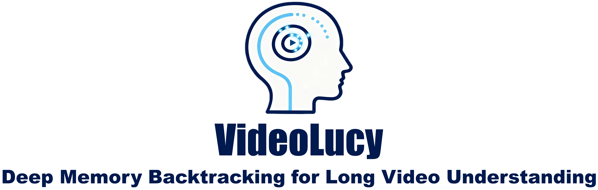

# VideoLucy

We propose **VideoLucy**, a deep memory backtracking framework for long video understanding. Inspired by the human recollection process from coarse to fine, VideoLucy employs a **hierarchical memory structure** with progressive granularity. This structure explicitly defines the detail level and temporal scope of memory at different hierarchical depths. Through an **agent-based iterative backtracking mechanism**, VideoLucy systematically mines video-wide, question-relevant deep memories until sufficient information is gathered to provide a confident answer. This design enables effective temporal understanding of consecutive frames while preserving critical details. In addition, we introduce **EgoMem**, a **new benchmark for long video understanding**. EgoMem is designed to comprehensively evaluate a model's ability to understand complex events that unfold over time and capture fine-grained details in extremely long videos.
